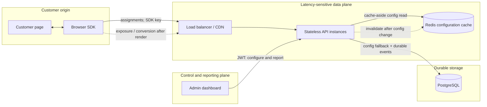
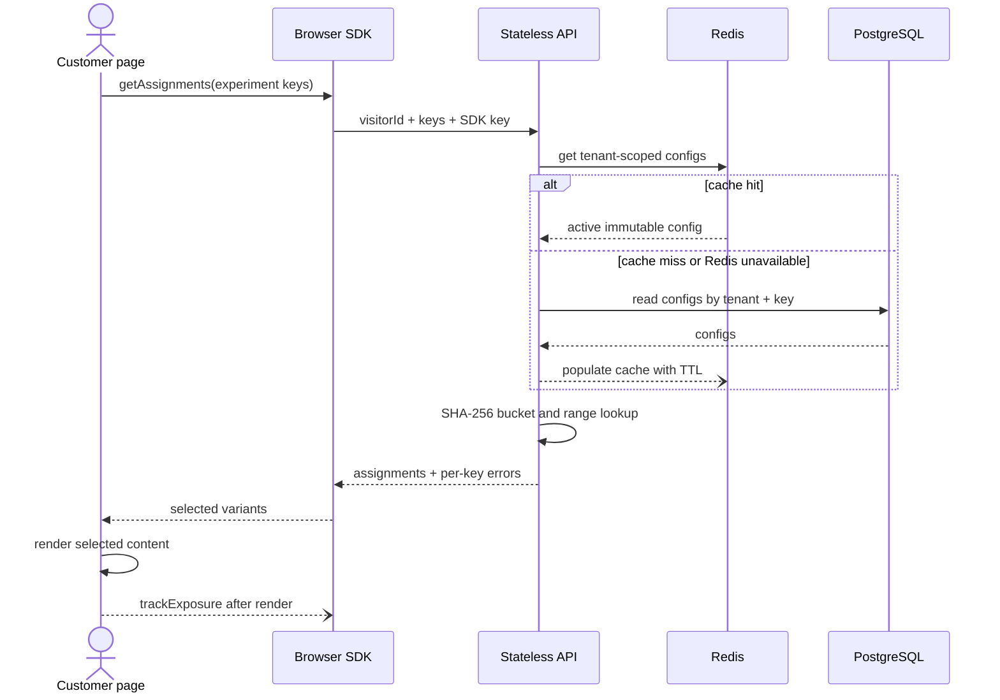
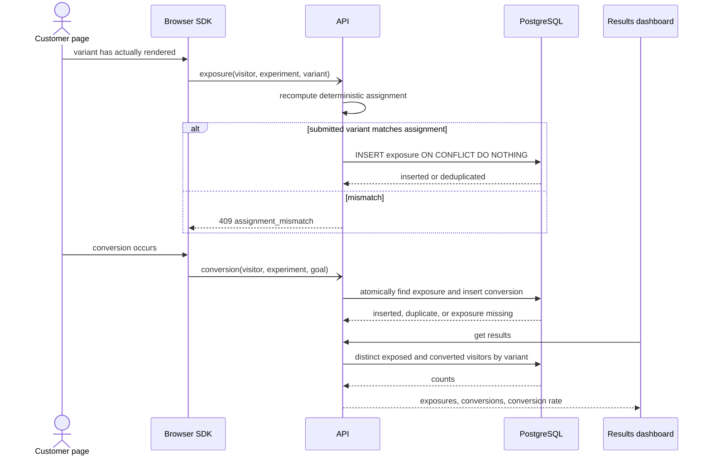
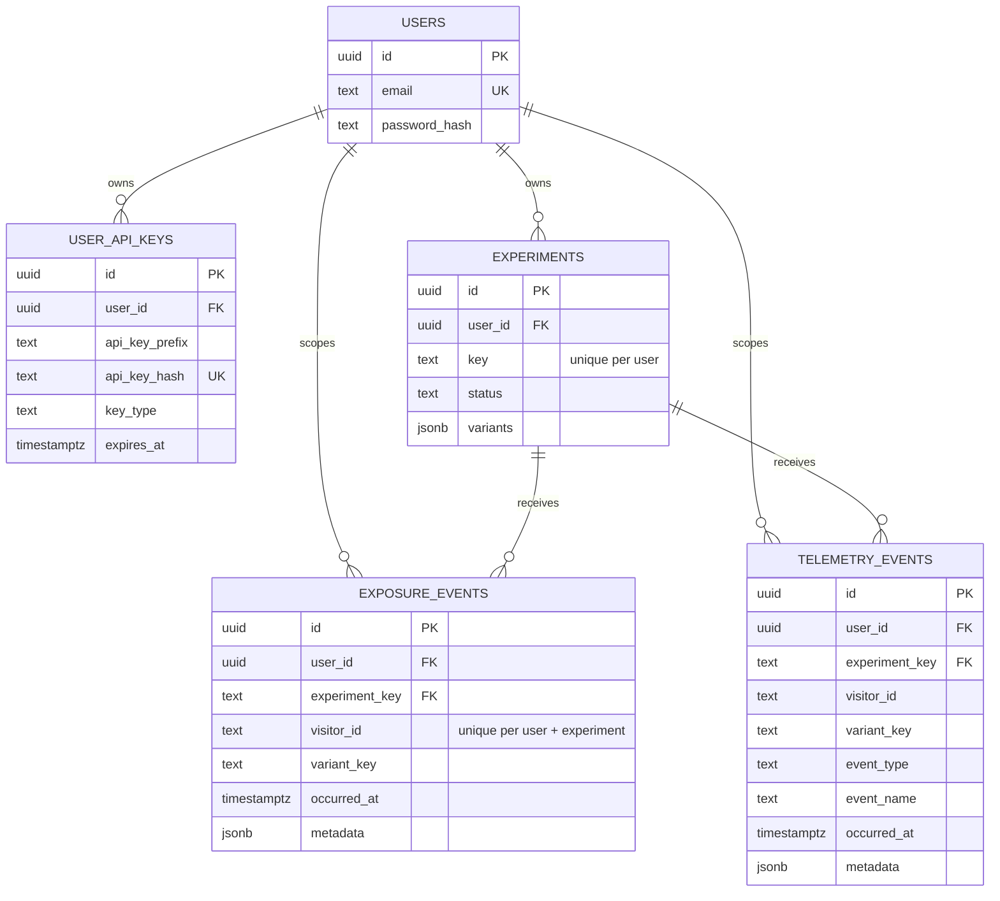

# Experiment Backend Service — Design

**Status:** Final design for the implemented MVP and its production scaling path  
**Audience:** Engineering, data science, SRE, and security reviewers  
**Scope:** Architecture, determinism, scale, reliability/failure modes, and correctness

The LLM decision and broader trade-offs/next steps are intentionally deferred for a separate discussion. Production hardening that is necessary to explain scale or reliability is still identified here and is clearly distinguished from the shipped MVP.

## 1. Goals and invariants

The service answers, on a customer's page-render path, “which variant should this visitor see?” and later records what that visitor was actually shown and whether they converted.

The design is built around five invariants:

1. **Never break the host page.** Experimentation is an enhancement. Failure must leave the customer's original experience intact.
2. **Assignment is deterministic and does not require a per-visitor database write.** The same `(tenant, experiment, visitor)` input and immutable configuration always produce the same output.
3. **Only observed treatments enter the denominator.** Assignment and exposure are separate; an exposure is recorded only after the variant is rendered.
4. **Retrying accepted events does not inflate results.** Database uniqueness constraints, not client behavior alone, provide idempotency.
5. **Configuration is tenant-scoped and immutable while running.** A running experiment cannot silently change the mapping used to assign or validate events.

For a production service, the assignment path should have an explicit latency and availability objective, for example p99 under 100 ms at the service boundary and at least 99.99% availability. The browser should use a tighter product-specific deadline than its overall page budget. These are target SLOs; the MVP does not yet include the production load tests or multi-region deployment needed to claim them.

## 2. Architecture

### 2.1 System context



The browser SDK owns first-party visitor identity, imposes a request deadline, caches assignments for the page lifecycle, and converts all SDK failures into a caller-visible error callback rather than an unhandled exception. The API is stateless with respect to visitor assignment, so instances can be added or removed without moving visitor state.

The API has two logical planes even though the MVP deploys them in one Node.js service:

- The **data plane** serves assignments and ingests events using restricted, publishable SDK keys. It is high-volume and must degrade safely.
- The **control plane** manages experiments, keys, and results using user JWTs (or server-only service keys). It is lower-volume, privileged, and not on the page-render path.

This trust-boundary split prevents a browser credential from changing an experiment or reading results. Every lookup and event is scoped by the authenticated key owner's `user_id`; experiment keys need to be unique only within that tenant.

### 2.2 Assignment flow



A batch can contain up to ten experiment keys. One missing or unavailable experiment does not fail successful keys: the API returns HTTP 200 with `assignments` plus per-key `errors`. This is deliberate fault isolation on the render path.

Assignment itself performs no durable write. PostgreSQL stores experiment configuration, but it does not store a visitor-to-variant row. That removes the highest-volume write from the critical path and makes server restarts irrelevant to stickiness.

### 2.3 Event and result flow



Exposure is sent only after render; a returned assignment is not evidence that a visitor saw it. Conversions do not trust a client-supplied variant. A single SQL statement derives the variant from the recorded exposure and inserts the conversion, closing both an attribution bug and a read/write race.

### 2.4 Data model



The source-of-truth constraints are:

- `(user_id, experiment.key)` is unique, preventing tenant collisions and accidental key reuse.
- `(user_id, experiment_key, visitor_id)` is unique for exposures, so a visitor contributes at most one denominator observation per experiment.
- `(user_id, event_type, event_name, experiment_key, visitor_id)` is unique for conversion events, so a visitor converts at most once per named goal in an experiment.
- Foreign keys prevent events for an experiment that does not exist in that tenant.

Variants are JSONB because they are a small configuration object fetched as a unit. This keeps assignment to one configuration read and supports static content. It is not intended for analytical joins; event rows copy the selected `variant_key` so historical aggregation does not need to expand JSON for every event.

### 2.5 Key decisions

| Decision | Reasoning | Consequence |
|---|---|---|
| Stateless deterministic assignment | A visitor mapping write on every new assignment would add latency, cost, and an availability dependency. | Assignment scales horizontally and survives restarts; identity stability and configuration immutability become essential. |
| PostgreSQL is authoritative; Redis is disposable | Configuration changes are rare, assignments are read-heavy, and correctness needs durable constraints. | Redis loss increases database load but does not lose data. Cache hits keep PostgreSQL off the normal assignment path. |
| Separate assignment from exposure | A response can arrive after navigation, be hidden, or never render. Counting it would bias the denominator. | The integration must explicitly signal render; event loss can reduce sample size but does not block the page. |
| Validate exposure and derive conversion attribution server-side | Browser payloads may be buggy, stale, duplicated, or manipulated. | Results cannot be contaminated by a claimed variant that conflicts with deterministic assignment or verified exposure. |
| Database-enforced idempotency | Network outcomes are ambiguous, so safe clients must be able to retry. | Duplicate retries are harmless across processes and restarts, not merely within one SDK instance. |
| Running configuration is immutable | Changing allocations or variant order changes bucket ranges and can move existing visitors. | Drafts may change; active/paused/archived configurations require a new experiment key/version for a materially new test. |
| Partial batch success | One bad experiment should not blank unrelated page components. | Callers receive useful assignments and structured errors in the same response. |

## 3. Determinism

### 3.1 Visitor identity

The SDK resolves identity in this order:

1. an explicit application-supplied visitor ID;
2. a first-party cookie with one-year expiry;
3. local storage;
4. an in-memory UUID for the current page session.

Cookie or local-storage persistence gives repeat visits the same randomization unit without keeping a server-side identity table. If storage is cleared, blocked, or a visitor changes browser/device, the service sees a new visitor. That is an explicit limitation of anonymous browser identity, not a hashing failure. Logged-in products should pass a stable, privacy-reviewed pseudonymous account ID when cross-device consistency is required.

### 3.2 Bucket algorithm

For each active experiment:

```text
hash_input = experiment_key + ":" + visitor_id
digest     = SHA-256(UTF-8(hash_input))
integer    = unsigned value of the first 32 digest bits
bucket     = integer mod 10,000                 # [0, 9,999]
```

Variants occupy contiguous, half-open bucket ranges in their configured order. For a 50/30/20 experiment:

```text
control:   [0, 5000)
treatment: [5000, 8000)
holdback:  [8000, 10000)
```

The first matching range wins. Configuration validation requires 2–5 unique variant keys, positive integer allocations, and a total of exactly 100. Integer percentages map to exact blocks of 100 buckets; the 10,000-bucket representation also leaves a clean path to 0.01% allocations later.

### 3.3 Why it is sticky and well distributed

- **Sticky:** SHA-256 is a pure function. With the same experiment key, visitor ID, algorithm version, variant order, and allocation, every API instance computes the same bucket. No process memory, cache contents, database row, or server restart affects the result.
- **Independent across experiments:** the experiment key is part of the hash input. A visitor assigned to treatment in one experiment is not systematically forced into treatment in another.
- **Well distributed:** for non-adversarial visitor IDs, a cryptographic hash makes digest values computationally indistinguishable from uniform. Each allocation therefore receives its configured share in expectation across the population. Small samples will vary randomly; deterministic hashing guarantees unbiased allocation, not exact ratios in every cohort.
- **Unambiguous input:** the explicit `:` separator prevents concatenation pairs such as `(ab, c)` and `(a, bc)` from becoming the same string under simple concatenation.

Taking 32 bits modulo 10,000 introduces a mathematically tiny modulo bias because 10,000 does not divide `2^32`; individual bucket probabilities differ by at most `1 / 2^32`. This is immaterial relative to sampling variance. If exact uniformity were a formal requirement, the implementation could use rejection sampling or a wider integer without changing the API.

Changing an active allocation or reordering variants would change range boundaries and move some existing visitors. The service prevents this by allowing configuration changes only while the experiment is `draft`. Pause/resume preserves configuration and therefore preserves assignment. A redesigned test receives a new experiment key/version, which deliberately creates a new randomization.

## 4. Scale

“Millions of calls” needs a rate and shape: one million calls per day averages only 11.6 requests/second, while one million calls in a minute is about 16,667 requests/second. The design scales by keeping assignment CPU-cheap and write-free, but the MVP and the production architecture have different limits.

### 4.1 Assignment/read path

For `A` assignment requests/second with an average of `E` experiment keys, hashing costs `O(A × E)` CPU and no event writes. SHA-256 over short strings is not the bottleneck. Network cache lookups, API-key authentication misses, connection limits, and JSON/logging overhead dominate first.

The shipped MVP performs cache-aside lookup per experiment and processes a batch's keys sequentially. That is simple and correct, but at high scale it creates up to `A × E` Redis round trips and turns several cache misses into serial PostgreSQL reads. Before sustained high-volume traffic, I would make the following data-path changes:

1. Add a small per-instance bounded LRU of immutable active configurations (seconds to a minute), backed by Redis. Most assignments then need no network read.
2. Fetch remaining keys with Redis `MGET`, and fetch database misses in one tenant-scoped SQL query rather than a loop.
3. Use request coalescing/single-flight and jittered TTLs to prevent a hot experiment's expiry from stampeding PostgreSQL.
4. Publish versioned invalidations on activation, pause, and archive. Retain the TTL only as a recovery bound.
5. Put the stateless API behind autoscaling and, at global scale, serve signed/versioned configuration near the edge so hashing can occur regionally without a cross-region database dependency.

API-key verification also sits before every assignment. The MVP caches verified keys in each process for five minutes; a production fleet should use a bounded cache and push revocation/version invalidations so database authentication misses do not scale with instances or expose an unbounded-memory risk.

### 4.2 Event/write path

Read traffic and write traffic scale differently:

| Path | Current behavior | Scaling characteristic | First production change |
|---|---|---|---|
| Assignment | Redis/config read + local hash; no visitor write | Stateless and horizontally scalable | LRU + `MGET` + bulk DB fallback |
| Exposure | One idempotent PostgreSQL insert | Scales with actually rendered experiments | Durable queue, batch consumers, date/tenant partitioning |
| Conversion | Verified-exposure lookup + idempotent insert in one SQL statement | Lower volume but latency-sensitive to attribution order | Durable queue with keyed ordering or short reconciliation window |
| Results | Aggregate distinct visitors from raw event tables | Cost grows with retained event volume and dashboard refreshes | Incremental rollups/materialized aggregates |

PostgreSQL is suitable for MVP durability and constraints, but direct inserts eventually make its WAL, indexes, IOPS, and connection count the ingestion ceiling. Adding API replicas alone would make that worse. The production ingestion API should acknowledge only after a replicated durable log accepts the event, then batch consumers should write partitioned event tables and update idempotent aggregates. Backpressure should shed nonessential custom telemetry before exposures or conversions.

The conversion-after-exposure dependency needs deliberate handling once ingestion is asynchronous. Events should be partitioned by `(tenant, experiment, visitor)` to preserve order, or unmatched conversions should enter a bounded reconciliation stream rather than being permanently dropped due to network reordering.

### 4.3 Results and retention

The MVP result query performs `COUNT(DISTINCT visitor_id)` over raw exposure and telemetry rows. This is exact and appropriate for a small dataset, but it becomes the reporting bottleneck before hashing does.

At scale, keep raw immutable events for audit/recomputation in partitioned storage, and maintain per-experiment/per-variant/per-goal rollups. A dashboard reads the rollups, not the event firehose. Partition pruning, read replicas, retention tiers, and asynchronous export to an analytical store isolate reporting from assignment and ingestion. Aggregates must be rebuildable from raw events, and their watermark should be shown so users know how fresh the result is.

### 4.4 What is cached

| Data | Cache policy | Why |
|---|---|---|
| Active experiment configuration and static variant content | Redis today, 60-second TTL; add bounded local LRU | Tiny, read-heavy, immutable while active, safe to replicate |
| Verified API-key record | Per-process TTL today; bounded/distributed invalidation at scale | Avoid a database read before every SDK call |
| Assignment response | Page-lifecycle memory in SDK; optional short edge/browser cache only when keyed privately by tenant, visitor, and config version | Avoid duplicate calls without leaking one visitor's variant to another |
| Raw events | Never cache as a substitute for durability | Loss or eviction would silently corrupt results |
| Result aggregates | Short TTL or read-through cache after durable rollup | Dashboard freshness can be slightly relaxed; assignment correctness cannot |

The full assignment endpoint must never be placed in a shared CDN cache unless the cache key includes all identity and configuration dimensions and responses are private. A cache-key mistake would cross-assign visitors or tenants.

## 5. Reliability and failure modes

### 5.1 Default behavior: original/control experience

The safe default is the caller's original experience, conventionally the `control` variant:

- If an assignment request fails, times out, returns no assignment, or is rate-limited, `getVariant(experimentKey, fallback)` returns the caller-provided fallback (`control` by default).
- If content is unavailable, the SDK returns the caller's fallback content; the page should retain its original server-rendered DOM rather than blanking or hiding it indefinitely.
- SDK methods absorb network and parsing failures and report them through `onError`; they do not throw an unhandled exception into the host page.
- A fallback caused by a failed assignment is **not** recorded as an exposure, because the SDK has no verified assignment cached. This avoids contaminating the control denominator with failure traffic.
- Exposure and telemetry are fire-and-forget after the UI action. Failure to measure must never undo the render or business action.

The demo integration uses a three-second SDK timeout. That proves bounded waiting, but it is too generous for many production render paths; customers should choose a much smaller deadline within their performance budget and render original content immediately when it expires. The server's PostgreSQL queries have a five-second timeout as a final resource bound, not as the desired assignment latency.

### 5.2 Failure matrix

| Failure | Current service behavior | User/page behavior | Operational response |
|---|---|---|---|
| Redis unavailable | Cache calls degrade to misses; PostgreSQL remains source of truth. Readiness reports Redis degraded, not unready. | Assignment continues, usually with higher latency. | Alert on miss rate/DB load; circuit-break Redis calls until recovery. |
| PostgreSQL slow/unavailable, config cached | Cached assignment can continue until TTL expiry; event writes fail. | Page renders assigned variant; measurement may be lost after one retry. | Protect DB with timeouts/pool limits; alert; preserve event durability via queue in production. |
| PostgreSQL slow/unavailable, cache miss | API returns a per-experiment `experiment_unavailable` or request-level error if authentication also misses. | SDK uses original/control fallback and does not record exposure. | Fail closed for measurement, open for page rendering. |
| Both Redis and PostgreSQL unavailable | No new verified assignment/config read; cached SDK assignments within an already running page remain usable. | New page loads use original/control fallback. | Declare data plane degraded; keep serving bounded errors rather than hanging. |
| API instance/network unavailable | Browser request times out or fails. | SDK swallows error and returns fallback; host page continues. | Multi-instance/load-balancer health checks, regional failover, error-budget alerting. |
| One bad key in a batch | Successful keys are returned; bad key gets a structured error. | Unrelated experiments still render. | Monitor per-key error reasons. |
| Duplicate/retried event | Unique constraint returns a successful deduplicated outcome. | No page impact and no count inflation. | Track dedupe ratio; spikes may reveal client/network problems. |
| Exposure arrives after conversion | Conversion currently returns `409 exposure_not_found`; SDK does not retry this semantic error. | Business action is unaffected, but conversion may be uncounted. | At scale, ordered ingestion or a reconciliation buffer is required. |
| Cache invalidation fails after status change | Stale status can be served for at most the current 60-second TTL. Variant mapping itself cannot change while active. | A recently paused experiment may briefly continue to assign. | Versioned invalidation and shorter local TTL; surface config version in events. |
| Instance termination during traffic | Instance stops accepting new application requests, drains in-flight requests, then closes Redis/PostgreSQL pools. | Load balancer sends new work elsewhere. | Termination grace period must exceed drain timeout. |
| SDK key abuse or traffic spike | Route-specific rate limit returns 429. MVP counters are per process. | SDK falls back; page remains functional. | Distributed rate limits/WAF by tenant and origin at scale; avoid logging raw credentials. |

PostgreSQL is mandatory at process startup; Redis is optional. Liveness checks only process health. Readiness requires PostgreSQL and reports Redis as degraded. This prevents routing fresh traffic to an instance that cannot authenticate cold keys or durably accept events, while not treating a cache outage as total service failure.

### 5.3 Isolation and overload behavior

Assignment, ingestion, and control-plane traffic should have separate concurrency pools, rate limits, and eventually separate deployments. A dashboard scan or telemetry flood must not exhaust the connections needed for page-render assignments. Load shedding should follow business criticality:

1. preserve cached assignment;
2. preserve durable exposure/conversion acceptance;
3. shed custom telemetry;
4. shed reporting and control-plane refreshes.

Logs and metrics must not contain plaintext API keys or raw visitor identifiers. Essential signals are assignment latency by cache outcome, cache hit rate, fallback/error rate, DB pool saturation, event acceptance/dedupe/rejection counts, ingestion lag, result watermark, and sample-ratio mismatch alerts.

## 6. Correctness

### 6.1 Assignment correctness

Correct assignment is protected at multiple layers:

- Input validation bounds visitor IDs, keys, batch size, variant count, content, metadata, and timestamps.
- Variant keys must be unique and allocations must be positive integers totaling exactly 100, so the bucket space has no gap or overlap.
- Tenant identity comes from the authenticated credential, never from a request field.
- Only `active` experiments assign.
- Active configuration cannot be edited, preventing reassignment drift.
- Unit tests assert deterministic repeatability, bucket bounds, approximate population distribution, and separator behavior. Integration tests assert multi-experiment stickiness, allocation behavior, no assignment writes, static content selection, and database fallback when Redis fails.

For long-term compatibility, the hash algorithm and bucket count are effectively a persisted data contract. A production configuration should store an explicit `assignment_algorithm_version` and configuration version. A future algorithm change must be opt-in via a new experiment version, never a silent deployment that re-buckets active visitors.

### 6.2 Counting and attribution correctness

The result denominator is unique visitors with a verified exposure, not assignment calls, page loads, or SDK invocations. This choice answers “among visitors who actually saw this variant, how many converted?”

The database protects the counting invariants:

- Exposure ingestion recomputes the deterministic assignment and rejects a mismatched `variantKey` with `409 assignment_mismatch`.
- The exposure unique key makes repeated renders/retries for one visitor count once per experiment.
- Conversion insertion looks up the verified exposure inside the same SQL statement and copies its variant. The client cannot choose attribution, and a conversion without an exposure is rejected.
- Conversion uniqueness makes retries idempotent per named conversion goal.
- Results join conversions to matching exposures and count distinct visitors. Therefore, for the binary “converted on any named conversion event” result currently returned, conversions cannot exceed exposures.
- Event writes are durable PostgreSQL writes; Redis is never the event system of record.

The current results endpoint aggregates distinct converting visitors across all `event_name` values in the experiment. That is a binary “converted at least once” metric, not one row per goal and not a count of conversion actions. Before supporting multiple business goals in one experiment, the results contract should require a selected primary `event_name` and report secondary goals separately. Likewise, server-accepted `occurredAt` values are bounded but the MVP does not enforce `conversion.occurred_at >= exposure.occurred_at`; production attribution windows must make that causal rule explicit.

No event pipeline can guarantee measurement when a browser closes, blocks requests, or loses connectivity. Database idempotency gives **at-least-once retry safety**, not magical exactly-once delivery from the browser. The correct operational response is to measure event-loss and fallback rates, avoid counting unverified fallbacks, and use server-side conversion events with stable idempotency keys for high-value transactions when available.

### 6.3 Statistical validity

The MVP deliberately reports descriptive counts and `conversions / exposures`; it does **not** declare a winner. A trustworthy product should only make inferential claims after the experiment design is registered and diagnostics pass.

For each experiment, record before activation:

- the randomization unit (here, visitor), target population, eligibility rule, and mutual-exclusion layer;
- one primary metric and its attribution window, plus guardrails and secondary metrics;
- baseline rate, minimum detectable effect, significance level, desired power, and intended sample size/duration;
- whether analysis is fixed-horizon or uses an approved sequential method.

Reporting should then include absolute and relative lift, confidence/credible intervals, sample size, runtime, data freshness, and a sample-ratio-mismatch (SRM) test comparing observed exposures with configured allocation. A severe SRM is a data-quality alarm—not evidence of treatment effect—and should suppress a “winner” label until investigated.

Repeatedly checking a conventional p-value and stopping when it crosses 0.05 inflates false positives. Use either the preregistered fixed horizon or sequentially valid boundaries/e-values. Correct for multiple comparisons when testing multiple treatments, goals, or segments. Segment analysis should be declared in advance or clearly labeled exploratory.

Operational validity matters as much as the formula. Exclude internal/test traffic by an explicit rule, detect bots, monitor missing exposure/conversion rates by variant, use an A/A test to validate the pipeline, and avoid mixing visitors across incompatible experiment versions. Novelty effects, weekday cycles, cross-device identity changes, interference between simultaneous experiments, and triggered-analysis selection can all invalidate an otherwise correct conversion-rate calculation.

The most important distinction is:

```text
deterministic assignment -> unbiased randomization in expectation
reliable event capture   -> trustworthy observed sample
valid analysis plan      -> defensible causal conclusion
```

All three are required. Correct hashing alone does not make a statistically valid experiment, and sophisticated statistics cannot repair systematically missing or misattributed events.

## 7. Scope deferred from this document

Per the current review scope, this document does not decide:

- where LLM generation runs or how its latency, cost, safety, and failures are handled;
- the broader trade-off inventory and roadmap, including adaptive allocation or learning across sites.

Those topics should be added only after the core design above is agreed, so they do not obscure the critical-path and measurement invariants.
