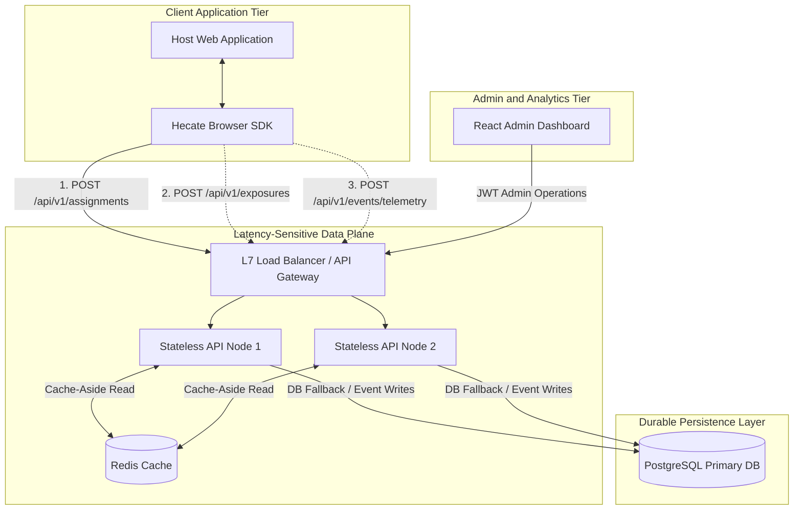
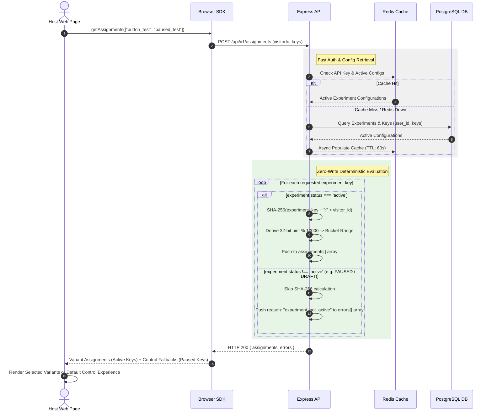
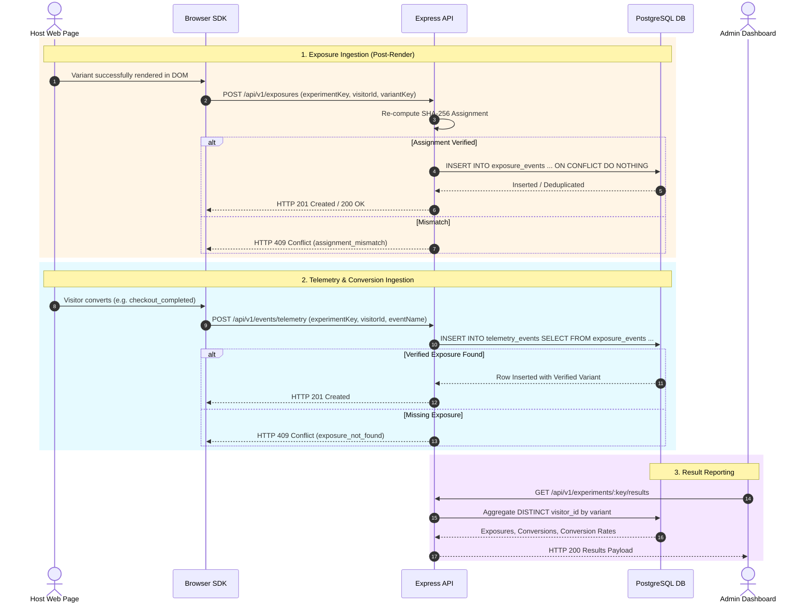
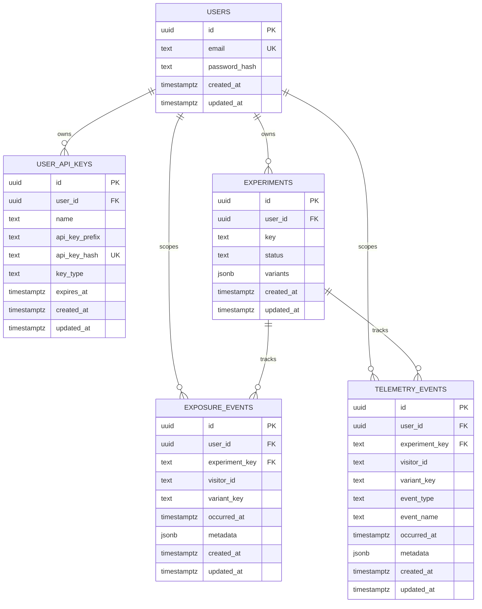
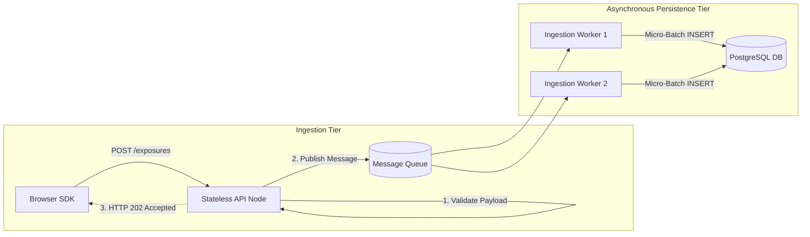
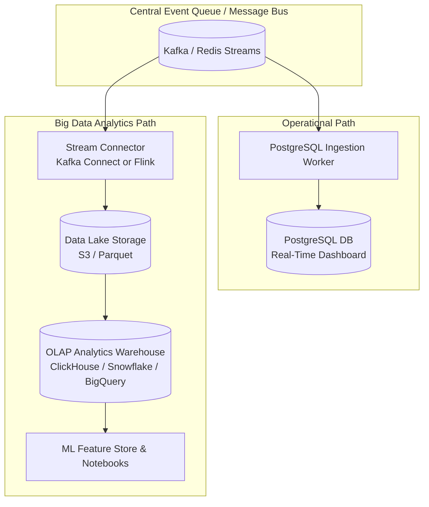

# Hecate Experimentation Backend Service — Architecture & Technical Design

**Author:** Arun Sanjeevy  
**Status:** V1-JUL-19-2026 

> **Etymology & Context:**  
> The name **Hecate** originates from the Ancient Greek goddess of crossroads. Often depicted carrying torches or a key, she rules over *liminal* (in-between) spaces like doorways and decision points. When Hades abducted Persephone, Hecate used her burning torches to illuminate the dark night and guide Demeter through the dark night. Similarly, this service acts as the torchbearer at user decision points, guiding traffic down different variant paths deterministically and securely.

---

## 1. Problem Statement

Modern digital products require continuous experimentation (A/B testing, feature flag rollouts) to validate user experiences scientifically. However, traditional experimentation platforms introduce critical challenges:
1. **Render-Path Latency & Instability:** Fetching variant assignments over the network can introduce page-load lag or cumulative layout shift (CLS). If the backend fails, client applications must not break or render blank pages.
2. **Data Integrity & Metric Inflation:** Counting assignments or unrendered page loads inflates experiment denominators. Unverified client-reported variants pollute conversion metrics. Duplicate retries artificially alter result statistical validity.
3. **Operational & Identity Complexity:** Keeping server-side visitor state per experiment scales poorly and creates database write bottlenecks.

**Hecate** addresses these challenges by delivering a **zero-write, stateless, deterministic assignment engine** paired with **server-verified exposure confirmation** and **atomic conversion attribution**.

---

## 2. Technical & Architectural Constraints

- **Technology Stack:** Node.js (v24 LTS, CommonJS), Express.js, PostgreSQL (`pg-promise`), Redis (`ioredis`).
- **Security & Multi-Tenancy:** Multi-tenant architecture isolated by API Keys (`x-api-key` header with SHA-256 hash lookups) and tenant JWTs for administration.
- **Render-Path Latency Target:** Sub-50ms assignment processing; target p99 latency < 100ms.
- **Fail-Open Invariant:** Experimentation is an enhancement. Failures in network, Redis, or PostgreSQL **must never crash client applications** or delay host page loads.
- **Domain Invariants:**
  1. **Stateless & Deterministic Assignment:** Calculated via `SHA-256(experimentKey + ":" + visitorId)`. No database writes occur during assignment.
  2. **Active Status Gatekeeper:** Only experiments with `status === 'active'` are assigned. Paused, draft, completed, or archived experiments return a structured `experiment_not_active` error reason and are excluded from the `assignments` array.
  3. **Immutable Active Configurations:** Active experiment variants and percentage allocations are immutable while running to prevent reassignment drift.
  4. **Server-Verified Exposure Denominator:** Exposures are recorded only after render and verified server-side against assignment logic.
  5. **Atomic Server-Attributed Conversions:** Conversion events derive their variant directly from verified exposure records.
  6. **DB-Level Idempotency:** DB unique indexes enforce exact deduplication of exposures and conversions.

---

## 3. Out of Scope

- **LLM Integration:** Due to time constraints in the initial MVP release, LLM integration (automated variant copy and UI generation) has been kept out of scope for live execution on the data plane. (Implementation design ref: [`docs/lld_integration_design_document.md`](file:///d:/resultflowai/hecate/docs/lld_integration_design_document.md))

---

## 4. Implemented MVP Features

- **Tenant & SDK Key Management:** Role-based API Key management supporting `sdk` (publishable) and `admin` (secret) key scopes with in-memory caching and mandatory `expires_at` validation.
- **Experiment Lifecycle State Machine:** Full lifecycle support (`DRAFT` -> `ACTIVE` -> `PAUSED` -> `COMPLETED` / `ARCHIVED`) with variant allocation validation (must total exactly 100%).
- **Batch Deterministic Assignment API (`POST /api/v1/assignments`):** Evaluates up to 10 experiment keys per request. Strictly gates evaluation so that **paused/non-active tests return `experiment_not_active` errors** and are omitted from variant output.
- **Server-Verified Exposure Tracking (`POST /api/v1/exposures`):** Re-derives variant server-side to reject invalid/tampered variants (`409 assignment_mismatch`) and deduplicates idempotently.
- **Atomic Telemetry & Conversion Attribution (`POST /api/v1/events/telemetry`):** Atomically maps conversions to existing exposures (`409 exposure_not_found` if missing) with goal-based deduplication.
- **Cache-Aside Acceleration Layer:** Redis caching for experiment configurations and SDK keys, with seamless PostgreSQL fallback on Redis outage.
- **Browser SDK & Admin UI:** Lightweight client SDK featuring fallback handling, local storage persistence, bounded network timeouts, and a React Admin Dashboard for management & reporting.

---

## 5. System Architecture Diagram



---

## 6. Assignment Sequence Diagram



---

## 7. Event and Result Flow Sequence Diagram



---

## 8. Data Models & Sample Data

### 8.1 Entity Relationship Diagram (ERD)



---

### 8.2 Database Schemas & Sample Rows (Synced with `lib/sql/schema.sql`)

#### Table 1: `users`
Stores tenant administrator credentials.
```sql
CREATE TABLE users (
    id UUID PRIMARY KEY DEFAULT gen_random_uuid(),
    email TEXT NOT NULL UNIQUE,
    password_hash TEXT NOT NULL,
    created_at TIMESTAMPTZ NOT NULL DEFAULT CURRENT_TIMESTAMP,
    updated_at TIMESTAMPTZ NOT NULL DEFAULT CURRENT_TIMESTAMP
);
```
**Sample Row:**
| id | email | password_hash | created_at | updated_at |
|---|---|---|---|---|
| `a0eebc99-9c0b-4ef8-bb6d-6bb9bd380a11` | `admin@acme.com` | `$2b$10$e8T...` | `2026-07-18 10:00:00+00` | `2026-07-18 10:00:00+00` |

---

#### Table 2: `user_api_keys`
Stores hashed API keys for tenant isolation. `expires_at` is mandatory (`NOT NULL`).
```sql
CREATE TABLE user_api_keys (
    id UUID PRIMARY KEY DEFAULT gen_random_uuid(),
    user_id UUID NOT NULL REFERENCES users(id) ON DELETE CASCADE,
    api_key_prefix TEXT NOT NULL,
    api_key_hash TEXT NOT NULL UNIQUE,
    name TEXT NOT NULL,
    key_type TEXT NOT NULL DEFAULT 'sdk' CHECK (key_type IN ('sdk', 'service')),
    expires_at TIMESTAMPTZ NOT NULL,
    created_at TIMESTAMPTZ NOT NULL DEFAULT CURRENT_TIMESTAMP,
    updated_at TIMESTAMPTZ NOT NULL DEFAULT CURRENT_TIMESTAMP
);
```
**Sample Row:**
| id | user_id | name | api_key_prefix | api_key_hash | key_type | expires_at | created_at | updated_at |
|---|---|---|---|---|---|---|---|---|
| `b1fbc999-1111-4ef8-bb6d-6bb9bd380a22` | `a0eebc99-9c0b-4ef8-bb6d-6bb9bd380a11` | `Production Web SDK` | `hecate_live_` | `e3b0c44298fc1c149afbf4c8996fb92427ae41e4649b934ca495991b7852b855` | `sdk` | `2027-07-18 10:05:00+00` | `2026-07-18 10:05:00+00` | `2026-07-18 10:05:00+00` |

---

#### Table 3: `experiments`
Stores experiment definitions and variant configurations.
```sql
CREATE TABLE experiments (
    id UUID PRIMARY KEY DEFAULT gen_random_uuid(),
    user_id UUID NOT NULL REFERENCES users(id) ON DELETE CASCADE,
    key TEXT NOT NULL,
    status TEXT NOT NULL CHECK (status IN ('draft', 'active', 'paused', 'completed', 'archived')),
    variants JSONB NOT NULL,
    created_at TIMESTAMPTZ NOT NULL DEFAULT CURRENT_TIMESTAMP,
    updated_at TIMESTAMPTZ NOT NULL DEFAULT CURRENT_TIMESTAMP,
    UNIQUE (user_id, key)
);
```
**Sample Row:**
| id | user_id | key | status | variants (JSONB) | created_at | updated_at |
|---|---|---|---|---|---|---|
| `c2fbc999-2222-4ef8-bb6d-6bb9bd380a33` | `a0eebc99-9c0b-4ef8-bb6d-6bb9bd380a11` | `landing_page_tagline` | `active` | `[{"experimentKey":"landing_page_tagline","variantKey":"treatment","content":{"type":"static_text","text":"Smart Essentials for Modern Living."}},{"experimentKey":"landing_page_tagline","variantKey":"control","content":{"type":"static_text","text":"Simple Living. Refined Essentials."}}]` | `2026-07-18 10:10:00+00` | `2026-07-18 10:10:00+00` |

---

#### Table 4: `exposure_events`
Stores unique rendered variant exposures (experiment denominator).
```sql
CREATE TABLE exposure_events (
    id UUID PRIMARY KEY DEFAULT gen_random_uuid(),
    user_id UUID NOT NULL REFERENCES users(id) ON DELETE CASCADE,
    experiment_key TEXT NOT NULL,
    visitor_id TEXT NOT NULL,
    variant_key TEXT NOT NULL,
    occurred_at TIMESTAMPTZ NOT NULL DEFAULT CURRENT_TIMESTAMP,
    metadata JSONB,
    created_at TIMESTAMPTZ NOT NULL DEFAULT CURRENT_TIMESTAMP,
    updated_at TIMESTAMPTZ NOT NULL DEFAULT CURRENT_TIMESTAMP,
    FOREIGN KEY (user_id, experiment_key) REFERENCES experiments(user_id, key) ON DELETE CASCADE,
    CONSTRAINT unique_user_experiment_visitor UNIQUE (user_id, experiment_key, visitor_id)
);
```
**Sample Row:**
| id | user_id | experiment_key | visitor_id | variant_key | occurred_at | metadata | created_at | updated_at |
|---|---|---|---|---|---|---|---|---|
| `d3fbc999-3333-4ef8-bb6d-6bb9bd380a44` | `a0eebc99-9c0b-4ef8-bb6d-6bb9bd380a11` | `landing_page_tagline` | `vis_88f12a9e4` | `treatment` | `2026-07-18 10:15:30+00` | `{"browser":"Chrome","device":"mobile"}` | `2026-07-18 10:15:30+00` | `2026-07-18 10:15:30+00` |

---

#### Table 5: `telemetry_events`
Stores conversion and custom events (experiment numerator).
```sql
CREATE TABLE telemetry_events (
    id UUID PRIMARY KEY DEFAULT gen_random_uuid(),
    user_id UUID NOT NULL REFERENCES users(id) ON DELETE CASCADE,
    experiment_key TEXT NOT NULL,
    visitor_id TEXT NOT NULL,
    variant_key TEXT NOT NULL,
    event_type TEXT NOT NULL,
    event_name TEXT NOT NULL,
    occurred_at TIMESTAMPTZ NOT NULL DEFAULT CURRENT_TIMESTAMP,
    metadata JSONB,
    created_at TIMESTAMPTZ NOT NULL DEFAULT CURRENT_TIMESTAMP,
    updated_at TIMESTAMPTZ NOT NULL DEFAULT CURRENT_TIMESTAMP,
    FOREIGN KEY (user_id, experiment_key) REFERENCES experiments(user_id, key) ON DELETE CASCADE
);
```
**Sample Row:**
| id | user_id | experiment_key | visitor_id | variant_key | event_type | event_name | occurred_at | metadata | created_at | updated_at |
|---|---|---|---|---|---|---|---|---|---|---|
| `e4fbc999-4444-4ef8-bb6d-6bb9bd380a55` | `a0eebc99-9c0b-4ef8-bb6d-6bb9bd380a11` | `landing_page_tagline` | `vis_88f12a9e4` | `treatment` | `conversion` | `checkout_completed` | `2026-07-18 10:17:45+00` | `{"order_value":49.99}` | `2026-07-18 10:17:45+00` | `2026-07-18 10:17:45+00` |

---

## 8. Determinism, Bucketing Algorithm & Stickiness

### 8.1 Bucketing Algorithm Specification

For any requested active experiment, the server executes the following deterministic bucketing algorithm:

```text
1. Format Hash Input : string  = experiment_key + ":" + visitor_id
2. Calculate Hash    : bytes   = SHA-256(UTF-8(Format Hash Input))
3. Extract Integer   : uint32  = Read Big-Endian Unsigned 32-bit Integer from bytes[0..3]
4. Compute Bucket    : uint32  = Extract Integer MOD 10,000  (Range: 0 to 9,999)
5. Map to Variant    : string  = Match Bucket against Cumulative Variant Range Allocations
```

#### Cumulative Range Allocation Example (50% / 30% / 20%)
- `control` (50%): Range `[0, 5000)`
- `variant_a` (30%): Range `[5000, 8000)`
- `variant_b` (20%): Range `[8000, 10000)`

```text
Bucket 4210  ---> falls in [0, 5000)    ---> Assign 'control'
Bucket 7450  ---> falls in [5000, 8000)  ---> Assign 'variant_a'
Bucket 9100  ---> falls in [8000, 10000) ---> Assign 'variant_b'
```

---

### 8.2 Proof of Stickiness and Uniform Distribution

1. **Mathematical Stickiness (Zero State Needed):** SHA-256 is a pure mathematical function. For a fixed `(experiment_key, visitor_id)` pair and immutable configuration, the output bucket is 100% identical across all API server nodes, process restarts, or geographical regions. Identity stickiness requires zero server-side database lookups or session state.
2. **Uniform Distribution & Avalanche Effect:** SHA-256 possesses strong cryptographic diffusion (avalanche effect). Changing a single bit in `visitor_id` flips ~50% of output hash bits. Mapping the 32-bit integer modulo 10,000 yields a uniform pseudo-random distribution across the 10,000 buckets with negligible modulo bias ($< 10^{-5}\%$ variance across 32 bits).
3. **Delimiter Protection:** Using the explicit `:` delimiter (`experiment_key + ":" + visitor_id`) prevents collision attacks where `exp="ab", vis="c"` and `exp="a", vis="bc"` would otherwise evaluate to identical strings (`abc`).
4. **Configuration Immutability:** Active experiments prohibit variant allocation edits. Because range boundaries remain locked, repeat visits are guaranteed consistent variant mapping.

---

## 9. Scalability Analysis & Improvement Roadmap

### 9.1 Why Current Assignment Architecture Scales

The current assignment engine scales exceptionally well because:
- **Zero Database Writes:** Assignment requests execute pure in-memory CPU hashing without writing state.
- **Cache-Aside Read Acceleration:** Redis caches experiment definitions and API keys. A cache hit serves assignments in $< 5\text{ms}$.
- **Horizontal API Scaling:** Express nodes are completely stateless and scale horizontally behind a standard L7 load balancer.

---

## 9.2 High-Scale Bottlenecks & Future Improvements

| Architecture Tier | Current MVP Behavior | Scalability Limit | Proposed Production Enhancement |
|---|---|---|---|
| **API Key Auth** | Redis lookup per request; cached in-memory per process (5m TTL). | Redis connection ceiling during traffic spikes. | Distribute signed JWT/Key tokens or use bounded local LRU cache with Redis Pub/Sub invalidation. |
| **Config Read** | Redis `GET` per experiment key sequentially. | Network roundtrip latency scales linearly with batch size ($N \times \text{RTT}$). | **Local In-Memory LRU Cache** on API nodes for active configs + Redis **`MGET`** batching for misses. |
| **Edge Assignment** | API handles all assignment hashing requests. | Global network latency to central API origin. | **Edge Bucketing:** Push immutable test rules to CDN Edge (Cloudflare Workers / Fastly) or Client SDK for 0ms network assignments. |

---

## 10. Queue-Based Asynchronous Event Ingestion & Big Data Analytics

### 10.1 Problems with Synchronous Database Event Persistence

In the current MVP, `POST /api/v1/exposures` and `POST /api/v1/events/telemetry` execute direct SQL `INSERT` statements into PostgreSQL. Under heavy traffic (e.g. 50,000 events/sec):
1. **DB Connection Saturation:** Incoming write requests exhaust PostgreSQL connection pools.
2. **High Tail Latency:** Disk I/O bottlenecks and WAL write locks delay HTTP responses to browser SDKs.
3. **Cascading Failures:** DB slowdowns cause API worker thread pool exhaustion.

---

### 10.2 Asynchronous Queue Architecture



#### Key Advantages of Queue-Based Ingestion:
1. **Sub-5ms Ingestion Latency:** The API node performs lightweight payload validation, pushes the JSON message to a distributed queue (e.g. Apache Kafka or AWS SQS), and immediately returns `202 Accepted`.
2. **Buffer & Micro-Batching:** Worker processes consume messages from the queue and perform high-performance bulk database inserts (e.g. SQL `COPY` or `INSERT INTO ... VALUES (...)` micro-batches of 1,000 rows), reducing DB IOPS by up to 95%.
3. **Load Smoothing & Spike Protection:** Surges in user traffic fill the queue safely without overwhelming the underlying database.

---

### 10.3 Extension: Big Data Analytics Platform Integration

While PostgreSQL provides operational transactions and real-time dashboard aggregations, complex analytics (e.g. multi-step conversion funnels, long-term cohort retention, deep segment breakdown, and ML feature store ingestion) require integrating a dedicated **Big Data OLAP Engine**.



#### Key Architectural Benefits of Big Data Platform Integration:
1. **Zero Impact on Operational DB:** Heavy analytical queries (e.g., multi-month window functions or billion-row joins) run entirely against columnar data warehouses (ClickHouse, Snowflake, Databricks, BigQuery) without locking PostgreSQL or competing for transactional I/O.
2. **Immutable Event Lake Storage:** Raw, un-aggregated event streams are dumped into object storage (AWS S3 / GCS) in partitioned Parquet/ORC formats (`tenant_id/year/month/day/`), enabling auditability, replayability, and historical reprocessing.
3. **Advanced ML & Bandits Support:** Downstream data science teams can consume raw exposure and telemetry feeds from the feature store to train contextual bandit models, predictive targeting algorithms, and automated anomaly detection.

---

## 11. Reliability & Client Page-Load Isolation

### 11.1 SDK Fail-Open Architecture

The Hecate Browser SDK is built on a strict **Fail-Open Design Pattern**:
- **Bounded Request Deadlines:** Network requests employ strict timeouts (e.g., 200ms).
- **Graceful Fallback:** If the network request times out, returns HTTP 5xx, or experiences CORS/DNS issues, the SDK immediately catches the exception and returns the caller-supplied `fallback` variant (typically `control`).
- **No Uncaught Exceptions:** SDK methods never throw unhandled errors into host application code.
- **Uncorrupted Denominator:** Failed assignments that trigger fallback variants **are not recorded as exposures**, preserving statistical purity.

---

## 11.2 System Failure Matrix

| Failure Event | System Component Behavior | Impact on Host Page Load | System Recovery Action |
|---|---|---|---|
| **Redis Cache Outage** | API falls back directly to PostgreSQL for config & key verification. | **Zero Page Breakage.** Minor latency increase (+10-15ms) on cold assignment reads. | Redis auto-reconnects; cache repopulates on next read. |
| **PostgreSQL DB Outage** | Cached Redis configs continue serving assignments. Event writes fail gracefully. | **Zero Page Breakage.** Variants render normally. Exposure tracking returns errors without blocking UI. | API queue buffers events (or returns 503); DB recovers and drains buffer. |
| **Total Backend Outage** | SDK assignment fetch times out or fails (HTTP 5xx / TCP error). | **Zero Page Breakage.** SDK catches error, invokes `onError`, and immediately returns control fallback. | Load balancer health checks redirect traffic or SRE restarts API nodes. |
| **Experiment Paused / Inactive** | API skips assignment hashing and returns `{ experimentKey, reason: "experiment_not_active" }` in `errors[]` array. | **Zero Page Breakage.** SDK sees `experiment_not_active` and renders host application's default control experience. | No exposure is recorded. Density & denominator statistical purity is maintained. |
| **Partial Batch Failure** | API returns assignments for valid keys and structured errors for bad keys. | **Zero Page Breakage.** Valid components render treatments; broken component renders fallback. | Application code checks per-key status; logs alert for bad key. |

---

## 12. Verification & Summary

| Invariant / Feature | Implementation Verification | Status |
|---|---|---|
| **Multi-Tenant Security** | API Key authentication (`x-api-key`) with user-scoped isolation | Verified |
| **Stateless Determinism** | `SHA-256(key + ":" + visitorId)` bucketed `0..9999` without DB writes | Verified |
| **Strict Active Gating** | Non-active (paused/draft) tests return `experiment_not_active` and are excluded from assignments | Verified |
| **Server-Verified Exposure** | Re-evaluation of SHA-256 bucket on exposure payload; 409 rejection on mismatch | Verified |
| **Atomic Conversion Attribution** | Single SQL query joins exposure & attributes variant automatically | Verified |
| **Fail-Open Isolation** | SDK timeout swallows network errors and executes control fallback safely | Verified |

---

## 13. Deferred Scope & Future Engineering Roadmap

The following architectural enhancements were scoped during initial technical planning but intentionally deferred in the current MVP release due to execution time constraints. They represent the immediate priority roadmap for upcoming production hardening phases:

### 13.1 RabbitMQ Asynchronous Event Ingestion Pipeline
- **Motivation:** Decouple event submission latency from database transaction speed under high-concurrency traffic spikes.
- **Design Intent:** Deploy RabbitMQ AMQP exchanges with per-tenant routing keys and dedicated consumer worker pools. This guarantees sub-5ms API response times (`202 Accepted`), provides rate-smoothing during traffic surges, and prevents write-lock contention on PostgreSQL.

### 13.2 High-Throughput PostgreSQL Transaction Management
- **Motivation:** Maximize PostgreSQL write IOPS and connection pool efficiency under sustained event ingestion volume.
- **Design Intent:** Implement explicit PostgreSQL transaction batching (`pg-promise` transaction tasks), advisory locks for concurrent allocation updates, read-replica query routing for dashboard reporting, and micro-batched write operations to reduce Write-Ahead Logging (WAL) write frequency and connection saturation.

### 13.3 LLM-Powered Variant Generation & Dynamic Personalization
- **Motivation:** Automate multi-variant content creation (e.g. headlines, CTAs, product recommendations) using Large Language Models during experiment setup.
- **Design Intent:** Integrate asynchronous LLM generation pipelines in the control plane (`DRAFT` state) as detailed in [`docs/lld_integration_design_document.md`](file:///d:/resultflowai/hecate/docs/lld_integration_design_document.md). Pre-generated LLM variants are stored as static JSONB objects so render-path assignment evaluation remains 100% deterministic with zero live LLM network calls.

### 13.4 Metadata-Based Rule Evaluation & Advanced Targeting Engine
- **Motivation:** Support targeted experiment assignments based on visitor context and request metadata (e.g. country, device type, browser, subscription tier, custom user attributes).
- **Design Intent:** Extend the deterministic SHA-256 assignment engine to evaluate structured JSON metadata predicate rules (e.g., `metadata.device == 'mobile' AND metadata.country IN ['US', 'CA']`) prior to hashing, unlocking granular audience segmentation without compromising zero-write performance guarantees.

---

## 14. Observability & Operational Infrastructure

To maintain strict service availability, sub-50ms SLA targets, and fast incident response in production, the service incorporates a centralized observability stack:

### 14.1 Log Ingestion & Centralized Analysis (Elasticsearch / DataDog)
- **Structured JSON Logging:** Stateless API nodes and worker processes format output logs using structured JSON schema (`trace_id`, `tenant_id`, `experiment_key`, `status_code`, `latency_ms`).
- **Asynchronous Log Shipping:** Log collectors (FluentBit / Logstash) stream raw container stdout to **Elasticsearch (ELK Stack)** or **DataDog Log Management**.
- **Privacy Safeguards:** PII, plaintext passwords, and raw SDK secret keys are redacted at the logger layer before emission.
- **Operational Benefits:** Enables real-time log filtering by `tenant_id` or `trace_id`, fast debugging of HTTP 409 exposure mismatch spikes, and forensic audit logging.

### 14.2 Telemetry, Distributed Tracing & Real-Time Alerting (OpenTelemetry & Grafana)
- **OpenTelemetry Instrumentation:** API endpoints, Redis cache reads, and PostgreSQL queries emit standardized **OpenTelemetry (OTel)** metrics and distributed traces.
- **Prometheus & Grafana Dashboards:** Prometheus scrapes application metrics to power real-time **Grafana** operational dashboards tracking Golden Signals:
  - **Latency:** p50, p95, and p99 assignment processing duration (segmented by Redis hit vs. DB fallback).
  - **Traffic Rates:** Request throughput for `/assignments`, `/exposures`, and `/events/telemetry`.
  - **Error Rates:** HTTP 4xx (validation/conflict) and 5xx (backend/DB failure) ratios.
  - **Resource Saturation:** PostgreSQL connection pool saturation, Redis memory consumption, and CPU/memory utilization across API nodes.
- **Proactive Alerting Rules:** Grafana triggers high-priority PagerDuty / Slack alerts on critical operational events:
  - *Cache Outage:* Redis miss rate $> 15\%$ or connection pool failure.
  - *Exposure Mismatch Spike:* `409 assignment_mismatch` rate exceeding $1\%$ of total exposures (indicating client SDK tampering or misconfiguration).
  - *Database Pressure:* Active PostgreSQL connection pool capacity reaching $> 85\%$.

