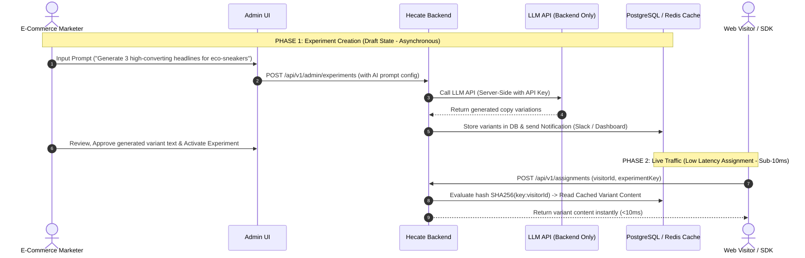
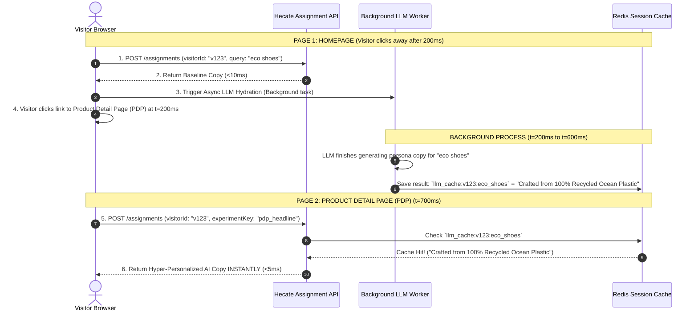

# Hecate LLM-Assisted Experimentation Engine — Low-Level Integration Design Document (LLD)

**Author:** Arun Sanjeevy  
**Status:** V1-JUL-19-2026  
---

## 1. Executive Summary & Core Architectural Invariants

Modern e-commerce platforms require continuous experimentation (A/B testing, feature flag rollouts) to validate user experiences scientifically. Integrating Large Language Models (LLMs) into experimentation enables dynamic content generation—such as personalized headlines, call-to-action (CTA) micro-copy, and product value propositions.

However, LLM APIs (e.g., OpenAI, Anthropic, Gemini) introduce three critical operational challenges:
1. **High Latency:** LLM inference takes 300ms to 3,000ms+, whereas assignment APIs must complete in **< 10ms – 50ms**.
2. **High & Variable Cost:** Per-token billing during live traffic spikes can cause unbudgeted cloud infrastructure expenses.
3. **Failure Vulnerability:** Rate limits (HTTP 429), API outages, and network timeouts can crash or delay host page rendering.

### The Golden Invariant of LLM Integration
> **An LLM API call must NEVER sit synchronously on the critical, render-blocking path of the assignment API (`POST /api/v1/assignments`).**

| Metric / Attribute | Synchronous Assignment Target | LLM API Call Characteristics |
| :--- | :--- | :--- |
| **Latency Target** | **< 10ms – 50ms** (p99 < 100ms) | **300ms – 3,000ms+** |
| **Cost Profile** | Fixed CPU/Memory infrastructure | Per-token variable cost ($$$ during traffic spikes) |
| **Reliability Target** | 99.99% availability (Stateless DB/Redis) | Prone to rate-limits (HTTP 429), timeouts, and outage |
| **User Experience Impact** | Imperceptible render | Causes layout flash (CLS), page lag, or blank elements |
| **Security Scope** | Publishable SDK Key (`x-api-key`) | Secret Backend API Key (`OPENAI_API_KEY`) |

---

## 2. System Placement & Architecture Patterns

```
                                  [ EXPERIMENT JOURNEY ]
                                            │
        ┌───────────────────────────────────┴───────────────────────────────────┐
        ▼                                                                       ▼
❌ SYNCHRONOUS PATH (PROHIBITED)                                        ✅ ASYNCHRONOUS / PRE-COMPUTED PATHS
User Requests Page ──> Assignment API ──> [LLM Call] ──> Render          1. Pre-Generation at Experiment Creation Time (Pattern A)
(Adds 500-2000ms latency, high cost, breaks fail-open)                   2. Persona-Bucket Matrix Pre-Warming (Pattern B)
                                                                        3. Two-Pass Non-Blocking Hydration (Pattern C)
```

### Pattern Summary Comparison

| Pattern | Generation Phase | Latency Impact | Persona Adaptability | Best Use Case |
| :--- | :--- | :--- | :--- | :--- |
| **Pattern A: Async Pre-Computation** | Experiment Setup (Draft State) | **0ms** (< 5ms Redis lookup) | Static across users per variant | Fixed A/B headline or value prop copy |
| **Pattern B: Persona Matrix Pre-Warming** | Experiment Setup / Cohort Worker | **< 5ms** (Pre-cached bucket lookup) | Cohort / Persona-based | Segment-targeted headlines (e.g. Bargain Hunter vs Luxury) |
| **Pattern C: Two-Pass Async Hydration** | Live Session (Background Worker) | **< 15ms initial** (Async hydration in 300-800ms) | Dynamic real-time user context | Search-intent alignment, cart drawer CTAs, PDP deep copy |

---

## 3. Pattern A: Asynchronous Pre-Computation at Experiment Creation

In Pattern A, the marketer specifies a prompt template during experiment creation (when the experiment is in `DRAFT` status). The backend invokes the LLM asynchronously, validates and sanitizes the output, and stores the generated text payloads directly in PostgreSQL and Redis. Once the content is ready for review, the e-commerce marketer will be sent notifications through their preferred channels (e.g., Slack alerts, dashboard notifications), after which the marketer can approve and activate the experiment. After activation, live shoppers will see the approved AI-generated content deterministically.



---

## 4. Pattern B: Pre-Calculated Persona Matrix

When variants must adapt to customer personas (e.g., *Bargain Hunter*, *Luxury Buyer*, *First-Time Visitor*) without introducing latency:

1. **At Experiment Creation:** The marketer configures persona buckets. The backend calls the LLM in advance to generate copy variations for each persona bucket and stores them in Redis:
   `llm_variant_cache:{experimentKey}:{personaId}:{variantId}`
2. **At Assignment Time:** The client sends ambient context (e.g., `utm_source`, `device`, `cart_value`). The server evaluates a sub-millisecond rule check mapping signals to a persona bucket and fetches the pre-generated copy from Redis in **< 5ms**.

```
Context Payload: { visitorId: "v123", utm_source: "instagram_ad", cart_value: 145.00 }
   │
   ├── SHA256 Hash Assignment ──> Variant B
   ├── Sub-1ms Rule Match     ──> Persona: "social_impulse_buyer"
   │
   └── Lookup Pre-Generated Copy in Cache ──> "Unlock 20% Off - Limited Time Offer!" (< 5ms)
```

---

## 5. Dedicated Deep Dive: Pattern C — Two-Pass Asynchronous Hydration

Pattern C is designed for scenarios where content must be dynamically generated based on **real-time shopping context** (e.g., specific search query terms entered 2 seconds ago, exact cart items, or dynamic live session behavior) while preserving sub-15ms initial page load.

### 5.1 Dual-Pass Execution Flow

A **`hydrationToken`** is a short-lived, cryptographically signed token returned in Pass 1 (`POST /api/v1/assignments`) and passed in the payload to Pass 2 (`POST /api/v1/variants/hydrate`) to securely authorize the background LLM generation, prevent unauthorized API abuse, and verify server assignment.

```
Pass 1: Synchronous Assignment (< 15ms)
├── Client calls POST /api/v1/assignments
├── Hecate evaluates SHA256 deterministic variant assignment
└── Returns Variant Identity + Fallback/Baseline Content + hydrationToken
    └── Host Page renders immediately (Zero Page Block, Zero Layout Shift)

Pass 2: Asynchronous Background Hydration (300ms – 800ms)
├── Browser SDK makes non-blocking call: POST /api/v1/variants/hydrate (passing hydrationToken)
├── Backend worker resolves LLM call (or fetches persona-cached LLM copy)
└── Returns Dynamic AI Content
    └── SDK smoothly updates DOM element or pre-populates micro-interaction components
```

---

### 5.2 Cross-Page Funnel Personalization & Session Pre-Warming

If a visitor navigates away quickly (e.g., stays on the homepage for only 200ms and clicks a category link), **the background LLM generation is NOT lost or wasted**.

Pattern C acts as a **Just-In-Time (JIT) Session Pre-Warmer**:



1. **Generation Persistence:** When the background job completes on Page 1, the result is saved in Redis under key `llm_cache:{tenantId}:{visitorId}:{experimentKey}` with a 24-hour TTL.
2. **Next-Page Cache Hit:** When the user lands on Page 2 (PDP, Cart, or Checkout), the assignment call checks Redis. The pre-generated LLM copy is served **instantly (< 5ms)**.

---

### 5.3 High-Value E-Commerce Touchpoints for Pattern C

1. **Cart Drawer Micro-Interactions:**
   * User lands on PDP. Baseline page renders instantly.
   * Background LLM generates custom cart urgency text based on cart total ($85) and shipping destination.
   * User clicks "Add to Cart" at t=5,000ms. Cart drawer opens showing: *"Add $15 more to unlock Free Express Shipping to Chicago!"* **(Loaded in 0ms from memory)**.
2. **Search-to-PDP Copy Alignment:**
   * User searches `"waterproof trail running shoes"` on the search bar.
   * While the user spends 3 seconds picking a shoe from the grid, Pattern C generates tailored product benefit points.
   * When the user clicks onto the PDP, the headline **"100% Waterproof Trail Comfort for Rain or Mud"** loads **in 4ms** directly from Redis.

---

### 5.4 Hydration API Contract (`POST /api/v1/variants/hydrate`)

A **`hydrationToken`** is a short-lived, cryptographically signed JWT or HMAC token returned by the server in Pass 1 (`POST /api/v1/assignments`) and sent back by the SDK in Pass 2 (`POST /api/v1/variants/hydrate`). 

**Why it exists:**
1. **Security & Cost Protection:** Prevents unauthorized malicious callers from spamming the backend LLM endpoint and inflating LLM API costs.
2. **Server-Verified Variant Authorization:** Encodes signed claims (`{ experimentKey, visitorId, assignedVariantKey, tenantId, exp }`) proving the server deterministically assigned this visitor to an AI-hydrated variant.
3. **Stateless Verification:** Allows the hydration worker to verify caller authenticity in **< 1ms** without querying PostgreSQL.

**Request Payload:**
```json
{
  "hydrationToken": "eyJhbGciOiJIUzI1NiIsInR5cCI6IkpXVCJ9...",
  "experimentKey": "pdp_benefit_bullets_v1",
  "visitorId": "vis_982347102",
  "context": {
    "search_query": "lightweight waterproof boots",
    "cart_total": 85.00,
    "user_city": "Chicago"
  }
}
```

**Response Payload (Hydrated Content):**
```json
{
  "status": "success",
  "experimentKey": "pdp_benefit_bullets_v1",
  "variantKey": "variant_b_ai",
  "hydrated": true,
  "payload": {
    "headline": "Ultra-Lightweight Waterproof Protection for Chicago Trails",
    "cta_text": "Add $15 More for Free Express Shipping",
    "badge_text": "Top Pick for Wet Conditions"
  },
  "cachedForSession": true
}
```

---

## 6. High-Impact E-Commerce Use Cases

| Touchpoint | Experiment Concept | Traditional Static Approach | LLM-Powered Persona Variant |
| :--- | :--- | :--- | :--- |
| **Homepage Hero Headline** | Intent & Traffic Source Alignment | Generic hero banner ("Welcome to Store") | **Ad-to-Landing Copy Mirroring:** Matches landing copy to Google search query or Instagram ad intent. |
| **PDP Value Proposition** | Persona Feature Highlight | Fixed product bullet points | **Dynamic Feature Framing:** Highlights eco-friendliness for *Sustainability Persona* vs durability for *Utility Persona*. |
| **Cart & Checkout CTAs** | Contextual Urgency & Thresholds | Static "Proceed to Checkout" button | **Dynamic Incentive CTAs:** <br>• Cart < $50: *"Add $12 to Unlock Free Shipping"*<br>• Cart > $100: *"Claim Free Gift & Complete Order"* |
| **Cart Abandonment Modals** | Dynamic Objection Handling | Static 10% discount pop-up | **Persona-Aware Incentive Framing:** Emphasizes free returns vs extended warranty based on user cart price sensitivity. |
| **Social Proof Micro-Copy** | Localized & Contextual Urgency | Static "Popular item" tag | **Hyper-Localized Micro-Copy:** *"18 shoppers in [User City] viewed this today"*. |

---

## 7. Security, Guardrails, & Multi-Tier Fallback Strategy

### 7.1 API Key Security
* LLM credentials (`OPENAI_API_KEY`, `ANTHROPIC_API_KEY`) reside strictly in backend environment variables.
* The Browser SDK only handles publishable SDK keys (`x-api-key`). No LLM credentials or raw system prompts are ever exposed to the client.

### 7.2 Multi-Tier Fallback Strategy

```
        ┌─────────────────────────────────────────────────────────┐
        │                 Incoming Assignment Request             │
        └────────────────────────────┬────────────────────────────┘
                                     │
                    Try Redis Cache for Persona-LLM Copy
                                     │
                    ┌────────────────┴────────────────┐
             [Cache Hit]                       [Cache Miss / Timeout]
                    │                                 │
           Return AI Copy (<5ms)             Fallback Tier 1: Return Pre-Generated
                                             Static AI Variant Copy
                                                      │
                                               [Missing/Failed]
                                                      │
                                             Fallback Tier 2: Return Baseline
                                             Control Variant (Fail-Open)
```

### 7.3 Content Safety & Output Sanitization
1. **Structured Output (JSON Schema Mode):** Force LLM responses to conform to strict JSON schemas enforcing exact key constraints and maximum character lengths.
2. **Local Sanitization Filter:** Run generated text through a local regex filter / bad-word list before storing in Redis/PostgreSQL to prevent hallucinated pricing, broken layout strings, or inappropriate terms.
3. **Fail-Open Enforcement:** Any JSON parsing error or timeout automatically triggers Tier 2 fallback to the baseline control variant, guaranteeing zero impact on user experience.
